# Table of Contents
* [Abstract](#0-abstract)
* [Introduction](#1-introduction)
* [Related Work](#2-related-work)
* [Technical Approach](#3-technical-approach)
* [Evaluation and Results](#4-evaluation-and-results)
* [Discussion and Conclusions](#5-discussion-and-conclusions)
* [References](#6-references)

# 0. Abstract

With the support of Neural Networks, the Machine Learning technique has been applied to more and more multidisciplinary cooperation, especially for music related research. In this project, the Neural Network applied Arduino Nano33 BLE board is used for classifying different emotions based on the motion data of the accelerometer during the musician playing the musical instruments. Through the Edge Impulse, the data from Piano (Keyboard), Clarinet (Wind instrument), Drum (Percussion), and Violin (String) are separately collected and the classifier models are built to be trained, and the exported package can be deployed to the connected Nano33 BLE board for live classification. 

# 1. Introduction

* Motivation & Objective

The beginners of playing instruments are always trying to improve their performance based on the expression of emotions. However, it is not possible for them to directly consult the masters who play pretty well in emotional expression of instruments, and it is not easy to even learn from them based on only watching or listening. In this case, it is better for learners to clearly understand what and how hard their emotions are during playing with a digital data standard and feedback. In this project, I collected the motion data of the accelerometer on Arduino Nano33 BLE board while the professional musicians are playing different instruments. According to the main categories of music instruments that can be summarized as four types: Keyboard, Wind instrument, Percussion and String, I chose one representative instrument for each of them to collect and analyze, which are Piano, Clarinet, Drum and Violin respectively. In order to ensure the data is trustworthy, I invited the players from UCLA Herb Alpert School of Music to play the instruments respectively, who major in the corresponding instruments. And due the trained model from those data through the Edge Impulse, I deployed the classifiers onto the Nano33 BLE board that are able to do the live classification. The future application for this project is assumed to be an instrumental training helper that assists musicians to practice their performance of emotion expression with clear and understandable feedback. 

* State of the Art & Its Limitations: 

Most of the currently existing research mainly focus on music genre classifications, which analyze the music features extracted from the audio signal information. However, the research toward emotion analysis is few, and the emotion analysis based on motion from instrument players is almost none. In this case, this project is very worth doing to check whether the classification model built on motion data would perform better or not. 

* Novelty & Rationale: 

After reading the state-of-art in researching musical emotion analysis, the accelerometer of the kinetic sensor is chosen to catch the information details of music players’ motions, which would extract the motion information through the acceleration changes in different dimensions (x, y, z). For the novelty, the first thing is I use the accelerometer data to go through the neural network for learning the motion features to further classify the emotions from them as the results in this area are still unclear. The second point is I will compare the performance of classifiers from four main categories of instruments, which are represented by Piano (Keyboard), Clarinet (Wind), Violin (String) and Drum (Percussion), and try to find out if there is any common phenomenon that requires further research in the future. The last point is that I will apply the trained classifier onto the Arduino Nano33 BLE as a rough demo of application of this project in practical situations. 

* Potential Impact:

From the practical situations, this project offers the results in music emotion classification in the direction of motion data, which would further contribute to more multidisciplinary research to better improve the neural network model designs for higher classification accuracy. And from the ideal situations, it is expected to become the efficient helper product for the beginners of music instruments to improve their emotion expression in performance. 

* Challenges: 

The risk is that before starting this project, I am not sure if the results would be better than the popular method of using audio signals to classify music emotions, which means the classification performance would be even worse than the previous research. And the challenge for this project is, in order to make the results of classifiers to be as trustworthy as possible, I need to strictly ask the performers to play as accurate as possible, and the data should be as more and as various as possible, which would be difficult to design this project with the period of only one quarter of study. 

* Requirements for Success: 

For the resource of data collected in this project, the requirements mainly focus on the musical instruments performers. It requires the professional players to play a series of music that accurately corresponds to the directions of emotion from the researcher. 

For the skills required from this project, it can be mainly concluded by the software part and hardware part. The software part requires the researcher to learn how to use the Edge Impulse to build the correct model with a series of parameters settings and block choices, and how to compare the models with different settings for picking the best model to further deploy. The hardware part requires the researcher to learn how to use Arduino Nano33 BLE board by flashing firmware of model onto the board and how to run the model for live test. 

* Metrics of Success:

In this project, the metrics of success are mainly based on the output of classification accuracy of the models based on different instruments data, which can be checked through two ways: The first way is the model evaluations on Edge Impulse. According to the function of Edge Impulse, it is able to run the self-validations based on the split data for tests, and the accuracy of classifying each emotion would be illustrated from a summarized confusion matrix. The second way is the live test on Arduino Nano33 BLE board. By correctly running the model on the Nano33 BLE board, a live test would keep running and refreshing the real-time classification of the emotions, which give the feedback in the form of percentages to emotions repsectively, and higher percentage indicates a more possible emotion that the player is expressing.

# 2. Related Work

To achieve the classification of music emotions or genres as accurate as possible, the most important thing is to abstract features from any possible output of musical data. Since there are already several methods applying to music classification analysis, the related work can be mainly introduced from four types of research. 

Audio signal
The first method[1], which is also the most commonly used one, directly extracts the features of music audio signal, and it is trying to train a model to further classify the music genres. Features from this method can be mainly introduced in the following four categories:

(1) Magnitude-based features (Timbral features)
Loudness, pitch, compactness, spectrum features (FFT magnitude of spectral rolloff, spectral flux, spectrum centroid, spectral spread, spectral decrease, spectral slope, spectral flatness, and Mel Frequency Cepstral Coefficients (MFCCs)

(2) Tempo-based features (rithmic aspects)
Bit per minute (BPM), Energy (audio signal intensity) in root mean square (RMS), and the Beat Histogram (peak, amplitude, and others)
  
(3) Pitch-based features 
Zero crossing rate (count of sign changes in consecutive blocks of an audio excerpt)

(4) Chordal progression features
Explore the pitch ‘chroma’: Twelve-dimensional vector with each dimension representing one pitch class, can be viewed as a distribution, where both the number of occurrences of a pitch and its energy can be deduced from the class values

A list of features maintained by the audio signal of music mentioned above can be listed as follows:  

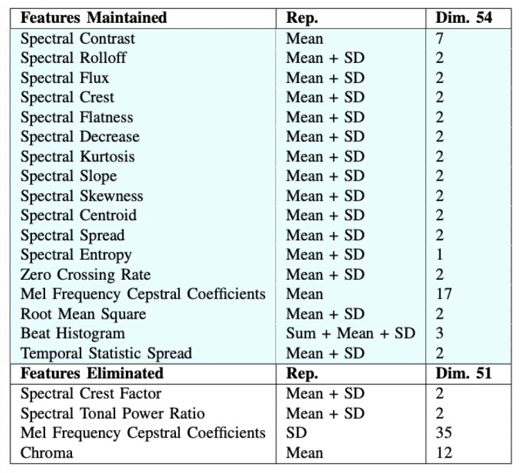

This research abstracts the features that mainly focus on a series of parameters such as spectral related properties. And by applying different classifiers to train the model based on these features, the accuracy results of them are shown as follows:  

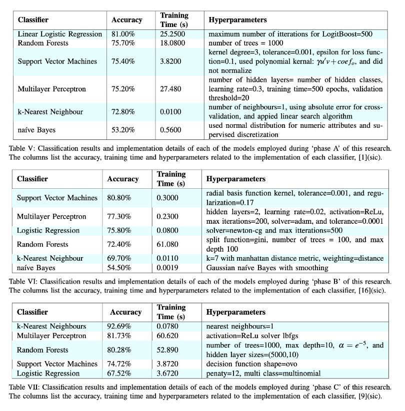

According to the results, the highest accuracy of this method can be 92% from using KNN with a training time of 0.078s. 

Visual Signal
The second method [2] is using the visual signal to further analyze, which the signal is picked from the frame of video recording a series of body motion of the performers. After removing the background noise of each frame,the bounding rectangle would be generated to focus the main area of motion, which the detail is as follows:  

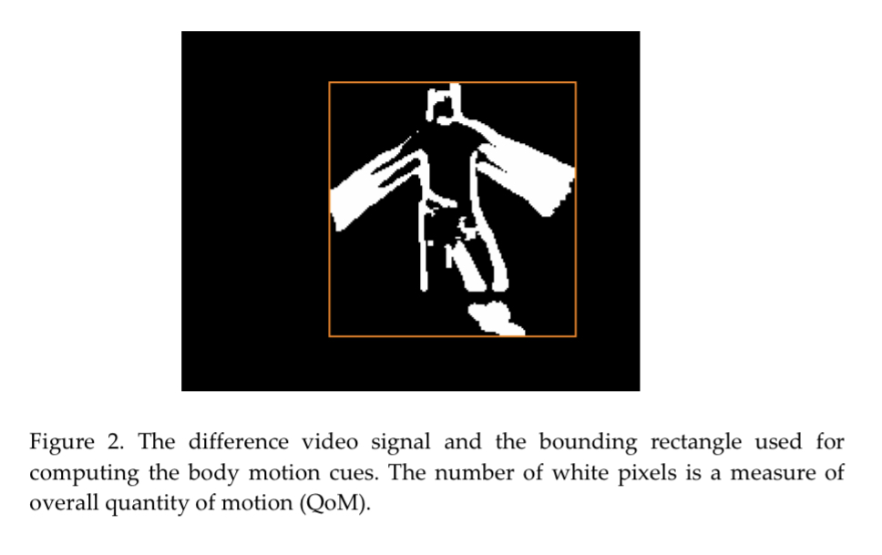

The number of white pixels with non-zero value is measured to be the overall quantity of motion (QoM), which is also summarized as a parameter called ‘cues’. Due to different changing behaviors of cues from different styles of music performance motions, several certain and basic emotion labels are marked to them correspondingly, which can be checked as follows: 

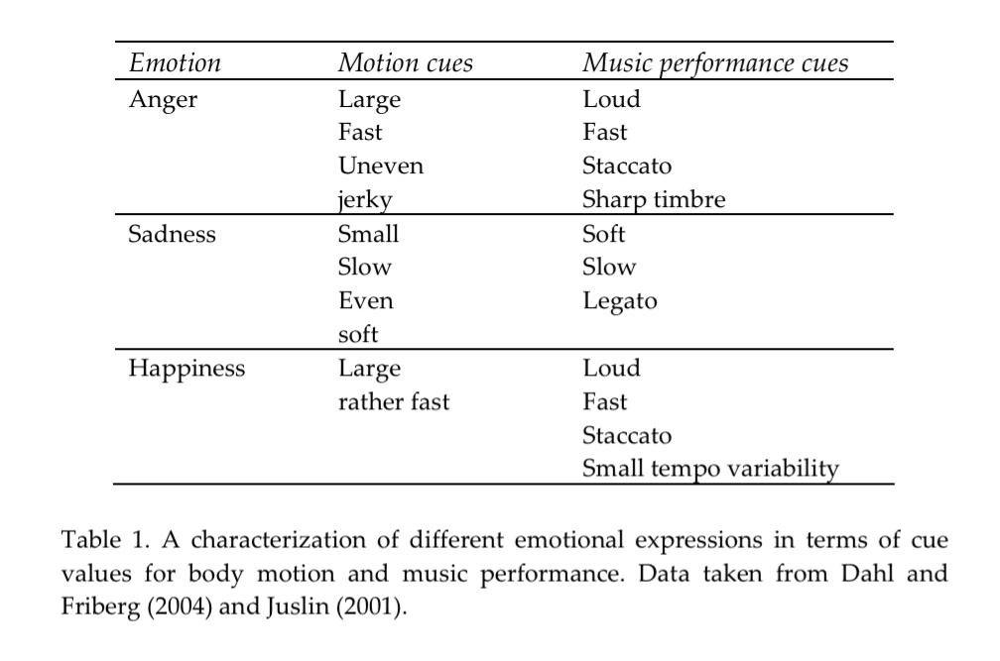

After mapping different emotions according to the visual signal in this way, the classifier models are trained to analyze the performers’ emotions properly. 

Physiological sensors signal
The third method [3] is using the physiological sensors to collect data while the musicians are playing the instruments. There are mainly four types of physiological sensors data can be used to abstract the features, which are introduced as follows:

(1) EMG Sensor [4], also known as electromyography sensor is one that measures small electrical signals generated by your muscles when you move them. 

(2) ECG Sensor [5], also known as electrocardiography sensor, records the electrical signals in the heart. 

(3) EEG Sensor [6], also known as electroencephalography sensor, evaluates the electrical activity of the brain. 

(4) Difference of performance average heart rate and neutral state average HR.

And the results of an example those collected sensors data while the musicians are playing the violin are shown as follows:

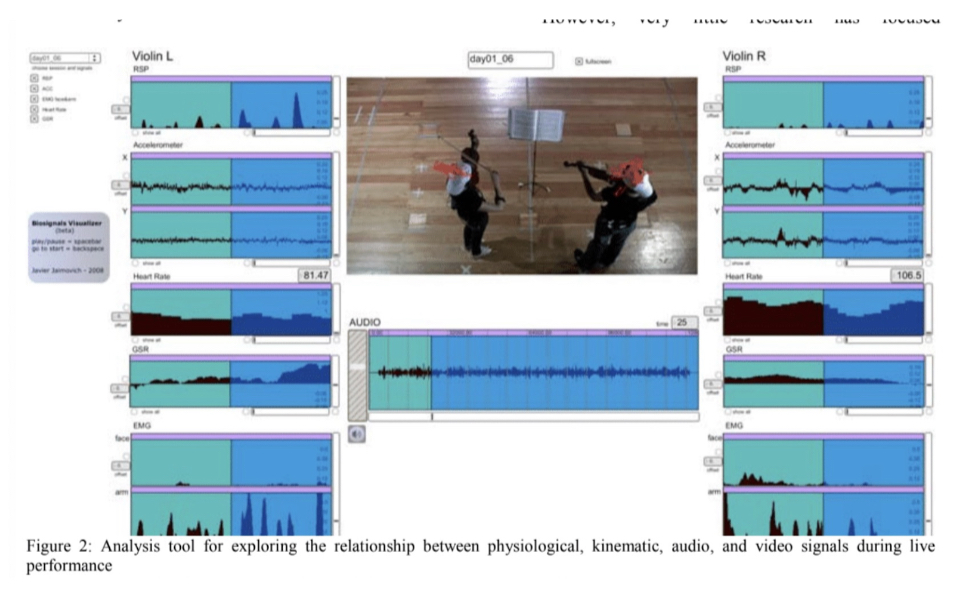

In this research, every gesture was annotated into a full musical score. While no direct measurement of emotion was used in this performance, this piece demonstrated the relations between physiological and audio signals during performance. 

Kinetic Sensors Signal
The last method [7] uses the data from the signal of kinetic sensors, especially from the Accelerometers. Two applications based on using accelerometers data are mainly the performance control and the tempo detection, which can be as follows:  

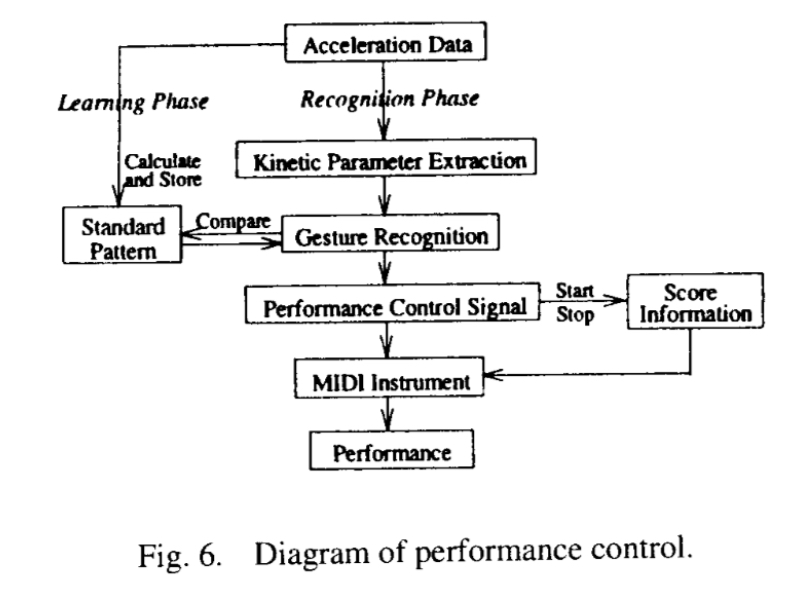

The workflow of performance control is shown above. It introduces that based on the extracted kinetic parameters, the gesture recognition model is built to output the instruction of controlling the MIDI instrument to do different patterns of performance according to different motions.  

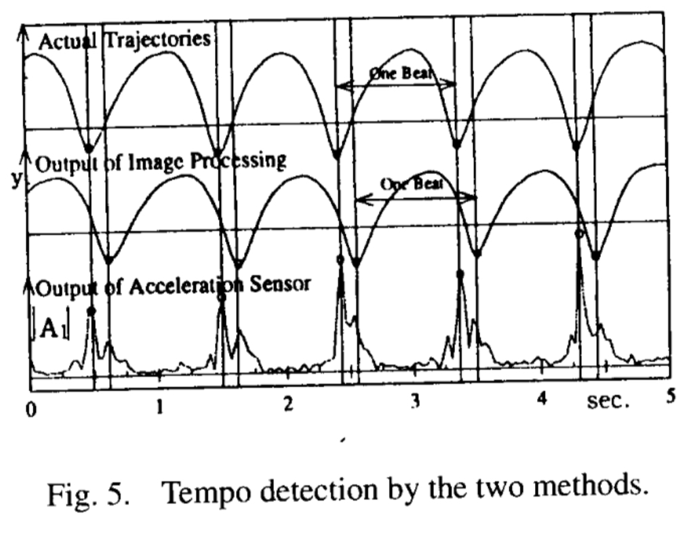

A sample of accelerometer sensor data along with actual trajectory and image processing output is shown above. A marker is attached to each top of the conductor’s baton, the tempo is extracted from the locus of the marker by image processing / acceleration data analysis. And by comparison, it can be observed that the acceleration method with even no lag in tempo detection according to the actual motion trajectory, which the image processing method generates an obvious lag instead. 

# 3. Technical Approach

The technical approach to this project can be mainly divided into four steps: Data Collection, Data Preprocessing, Model settings and Nano33 BLE Board Deployment. The details are introduced as follows:

(1) Data Collection
As mentioned in the previous introduction, I invited several students from UCLA Herb Alpert School of Music to play their majoring instruments of Piano, Clarinet, Violin and Percussion. The sensor connection and attachment are as follows:

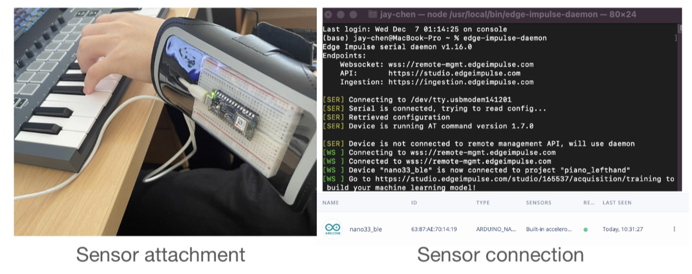

In the left graph, it shows that the sensor (accelerometer on Arduino Nano33 BLE Board) is attached to the wrist of players. And in the right graph, it shows that the data would be collected to be directly uploaded into the Edge Impulse Project through the wire connection. In this time, an overview of collected data can be checked through the following table:  

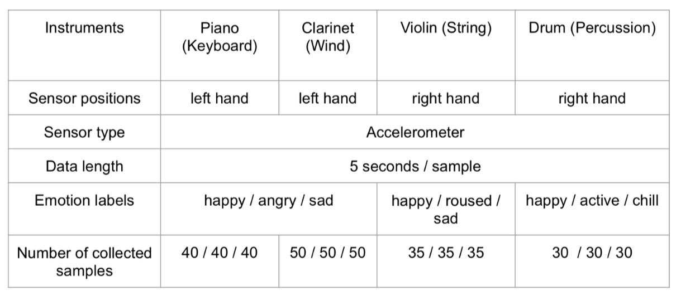

Based on the playing characteristics of different instruments, sensors are attached to the left hand for the Piano and Clarinet, while for the Violin and Drum it is attached to the right hand. Meanwhile, the emotion labels are basically given by three types for each instrument. Lastly, the numbers of collected samples (5 second for each sample) are shown as well. 

(2) Data Preprocessing
As the motion data samples are collected as shown above, there is an important step of preprocessing those samples. Since the performers play the instruments consecutively, some samples would record the data of the transition part (e.g. happy -> sad) in music, which is not good to be marked with one certain type of emotion to be further trained. In order to acquire the accurate features from these samples, I need to manually check each of them and delete those are in the transition part, which can be further compared in the following example:

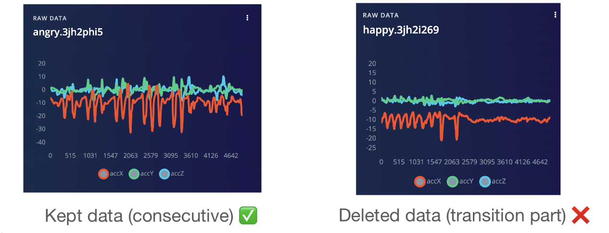

(3) Model Settings
After preparing the samples data as the input into the model, the next step is to design the model. The models on Edge Impulse can be easily built by setting the input block (input axes, window size, window increase,sampling frequency, zero-pad data), the processing block (Spectral Analysis), and learning block (Keras, K-Means). Here I choose Keras with Neural Network classification as the learning method because Keras prefers known processes, while K-means prefers unknown processes. After clicking the button of ‘Generate Features’, the features generated from the Spectral Analysis method would illustrate the details of summarized features that would automatically generate the settings of input layer, dense layer and output layer of the Neural Network. At last, click the ‘Start Training’ button, the results of trained classifiers would illustrate the confusion matrix about how many samples’ emotions are correctly detected, and how many of them are incorrectly estimated according to the split test data, which a total accuracy would be displayed on the top as well. 

(4) Nano33 BLE Board Deployment
After finishing the model training process, the last step is to export the trained model and deploy it onto the Arduino Nano33 BLE for live test. With the function of Edge Impulse, the model can be exported in a package according to the chosen type of target board. Then the downloaded package can be unzipped to run the flash_mac.command file (for Mac OS) to flash the firmware of the model onto the Nano33 BLE board. After that, open another terminal to run the command ‘edge-impulse-run-impulse’, the results of emotion detection would keep refreshing, which would give the feedback in form of percentages to each labeled emotion, and the higher percentage indicate a more possible emotion the player is expressing. 

# 4. Evaluation and Results

The results of this project can be concluded as three parts:

(1) Model tuning comparison
The first part is the results of model tuning. With the function EON from Edge Impulse, it would generate different models settings with the different classification accuracy from a certain instrument’s motion data (listed in the order of high to low). The top three models for each instrument are picked to show as follows:

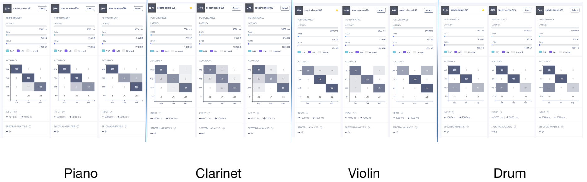

The differences among different models are based on the settings of the input window size, window increase, the number of FFT points, filters, and dropout rate. 

(2) Classification performance of different instruments
The second part compares the classification performance from the best model of each instrument in parallel, which aims to find if there is any common phenomenon that happens in different instruments. The results can be shown as follows:  

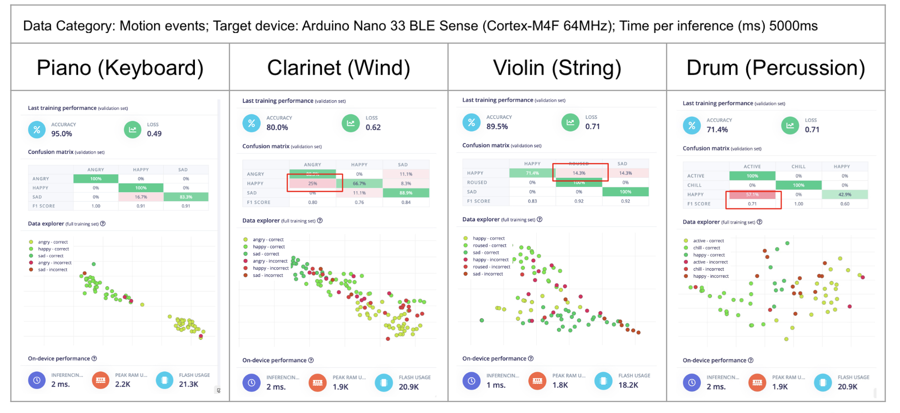

It can be found that the model of the Piano owns the highest classification accuracy of 95%, while the model of the Drum owns the lowest classification accuracy of 71.4%. To further get a closer look in the incorrect classification cases, there is a common phenomenon that it seems to be difficult to classify the emotion of happy and angry in almost all four instruments. This is within my expectation because the motion of expressing happy and anger would be similar in some way, especially for the Percussion. 

(3) Live test on Nano33 BLE Board
The last part is to check the performance of classifiers on Arduino Nano33 BLE board. Since the test process follows the procedure of recording for 5 seconds and then give the feedback of percentages of different emotions, a demo of the live test can be found through the link of demo video, which took the Piano as an example, and the player was asked to play emotion from sad to happy, and lastly to angry. The live test feedback was pretty good at feedbacking the correct emotion with a higher percentage.  

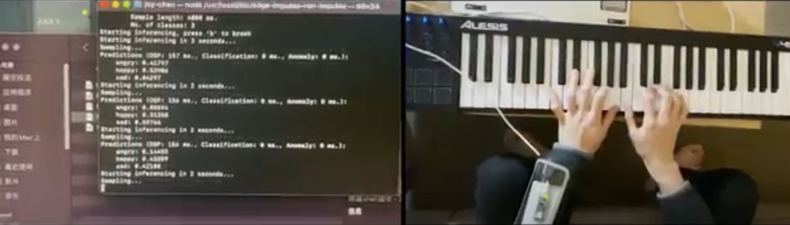

# 5. Discussion and Conclusions

With the cooperation between machine learning and music performance, this project discovers the music emotion classification performance based on motion data from accelerometer, which achieves great accuracy in some instruments such as the Piano and Violin with almost over 90%. Meanwhile, this project compares the classification performance among four main musical instruments in parallel, which finds out the common difficulties of classification between happy and angry. Lastly, this project achieves the deployment of the classifier model onto the Arduino Nano33 BLE board for live test, which gives a rough prototype of instrument practicing helper product. 

For the future direction, analysis of more kinetic motion data such as Gyroscope and MAgnetometer data can be further checked. Besides, since this project only took one performer for each instrument and one instrument for each category to sample data, this project can generate the more universal classifiers with more volume of data from more performers and more instruments. Last but not least, since only Keras was taken as the learning method in this project, more models can be used to check the accuracy of emotion classification because Edge Impulse is able to upload your self-create model to train. 

# 6. References

[1] Ndou, N. (2021). Music Genre Classification: A Review of Deep-Learning and Traditional Machine-Learning Approaches [The University of the Witwatersrand]. Available from: 
https://ieeexplore.ieee.org/stamp/stamp.jsp?arnumber=9422487

[2] Friberg, A. (2004). A fuzzy analyzer of emotional expression in music performance and body motion [KTH-Royal Institute of Technology]. Available from: 
https://www.researchgate.net/profile/Anders-Friberg/publication/270819324_A_fuzzy_analyzer_of_emotional_expression_in_music_performance_and_body_motion/links/54bd65410cf218d4a16a27d8/A-fuzzy-analyzer-of-emotional-expression-in-music-performance-and-body-motion.pdf

[3] Knapp, R. B. (2009). Measurement of Motion and Emotion during Musical Performance [Sonic Arts Research Centre, Queen’s University]. [Online] Available from : 
https://ieeexplore.ieee.org/stampPDF/getPDF.jsp?tp=&amp;arnumber=5349469&amp;ref=aHR0cHM6Ly9zY2hvbGFyLmdvb2dsZS5jb20v

[4] What is EMG sensor, Myoware and How to use with Arduino? - Latest Open Tech From Seeed. (n.d.). Latest Open Tech From Seeed. [Online] Available from: 
https://www.seeedstudio.com/blog/2019/12/29/what-is-emg-sensor-myoware-and-how-to-use-with-arduino/

[5] Electrocardiogram (ECG or EKG) - Mayo Clinic. (2022, March 19). Mayo Clinic - Mayo Clinic. [Online] Available from: https://www.mayoclinic.org/tests-procedures/ekg/about/pac-20384983

[6] The Introductory Guide to EEG (Electroencephalography). (n.d.). EMOTIV. [Online] Available from: 
https://www.emotiv.com/eeg-guide/

[7] Sawada, H. (1997). Gesture Recognition Using an Acceleration Sensor and Its Application to Musical Performance Control [Waseda University]. Available from:
https://onlinelibrary.wiley.com/doi/pdf/10.1002/(SICI)1520-6440(199705)80:5%3C9::AID-ECJC2%3E3.0.CO;2-J

# 7. Acknowledgement

